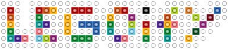

<!-- Improved compatibility of back to top link: See: https://github.com/othneildrew/Best-README-Template/pull/73 -->
<a id="readme-top"></a>
<!--
*** Thanks for checking out the Best-README-Template. If you have a suggestion
*** that would make this better, please fork the repo and create a pull request
*** or simply open an issue with the tag "enhancement".
*** Don't forget to give the project a star!
*** Thanks again! Now go create something AMAZING! :D
-->


<!-- PROJECT SHIELDS -->
<!--
*** I'm using markdown "reference style" links for readability.
*** Reference links are enclosed in brackets [ ] instead of parentheses ( ).
*** See the bottom of this document for the declaration of the reference variables
*** for contributors-url, forks-url, etc. This is an optional, concise syntax you may use.
*** https://www.markdownguide.org/basic-syntax/#reference-style-links
-->
[![Contributors][contributors-shield]][contributors-url]
[![Forks][forks-shield]][forks-url]
[![Stargazers][stars-shield]][stars-url]
[![Issues][issues-shield]][issues-url]
[![MIT][license-shield]][license-url]

<!-- PROJECT LOGO -->
<br />
<div align="center">
  <a href="https://github.com/russ3llc/legoify">
    
  </a>

<h3 align="center">Legoify</h3>

  <p align="center">
    A CLI to create a mosaic from an image using LEGO colors and output reference pictures & the part list.
    <br />
    <a href="https://github.com/russ3llc/legoify"><strong>Explore the docs »</strong></a>
    <br />
    <br />
    <!-- <a href="https://github.com/russ3llc/legoify">View Demo</a>
    &middot; -->
    <a href="https://github.com/russ3llc/legoify/issues/new?labels=bug&template=bug-report---.md">Report Bug</a>
    &middot;
    <a href="https://github.com/russ3llc/legoify/issues/new?labels=enhancement&template=feature-request---.md">Request Feature</a>
  </p>
</div>

<!-- ABOUT THE PROJECT -->
## About The Project

![Legoify Screen Shot][product-screenshot]

Legoify is a command line tool written in Python that helps you make mosaics using building blocks.

### Built With

* [![Python][Python]][Python-url]

<!-- GETTING STARTED -->
## Getting Started
### Prerequisites

* Python 3.9.2 - plans to support newer versions of Python: https://github.com/russ3llc/legoify/issues/2

### Installation
```
pip install git+https://github.com/russ3llc/legoify.git --upgrade
```

<!-- USAGE EXAMPLES -->
## Usage

```
legoify "path/to/source/image.png" 32
```
### Positional Arguments
| Argument   | Description                    | Example                                                     |
| --------   | -----------                    | -------                                                     |
| input_path | The path to the input image    | "C:\Users\hiimr\Pictures\Album Art\Father Of The Bride.jpg" |
| height     | The height of the output image | 48                                                          |

### Options
| Option          | Short Code | Description                                                                                                        | Example                                 |
| ------          | ---------- | -----------                                                                                                        | -------                                 |
| --help          | -h         | Lists arguments and options                                                                                        | N/A                                     |
| --output_dir    | -o         | The path to output images. Defaults to 'Output'                                                                    | "C:\Users\hiimr\Pictures\Album Mosaics" |
| --width         | -w         | The width of the output image. Defaults to height if not specified                                                 | 48                                      |
| --dither        | -d         | The dither algorithm to use - `None` (default), `naive`, `bayer`, `floyd`, `atkinson` (ordered fastest to slowest) | naive                                   |
| --color_filters | -c         | Save additional reference images of individual colors                                                              | N/A (this option is a flag)             |

<!-- CONTRIBUTING -->
## Contributing

Contributions are what make the open source community such an amazing place to learn, inspire, and create. Any contributions you make are **greatly appreciated**.

If you have a suggestion that would make this better, please fork the repo and create a pull request. You can also simply open an issue with the tag "enhancement".
Don't forget to give the project a star! Thanks again!

1. Fork the Project
2. Create your Feature Branch (`git checkout -b feature/AmazingFeature`)
3. Commit your Changes (`git commit -m 'Add some AmazingFeature'`)
4. Push to the Branch (`git push origin feature/AmazingFeature`)
5. Open a Pull Request

### Top contributors:

<a href="https://github.com/russ3llc/legoify/graphs/contributors">
  
</a>

<!-- LICENSE -->
## License

Distributed under the MIT. See `LICENSE.txt` for more information.

<!-- ACKNOWLEDGMENTS -->
## Acknowledgments

* [Pyxelate](https://github.com/sedthh//tree/master/pyxelate) - This open source project is what does most of the heavy lifting (doing the actual pixelation) in this project.

<p align="right">(<a href="#readme-top">back to top</a>)</p>

<!-- MARKDOWN LINKS & IMAGES -->
<!-- https://www.markdownguide.org/basic-syntax/#reference-style-links -->
[contributors-shield]: https://img.shields.io/github/contributors/russ3llc/legoify.svg?style=for-the-badge
[contributors-url]: https://github.com/russ3llc/legoify/graphs/contributors
[forks-shield]: https://img.shields.io/github/forks/russ3llc/legoify.svg?style=for-the-badge
[forks-url]: https://github.com/russ3llc/legoify/network/members
[stars-shield]: https://img.shields.io/github/stars/russ3llc/legoify.svg?style=for-the-badge
[stars-url]: https://github.com/russ3llc/legoify/stargazers
[issues-shield]: https://img.shields.io/github/issues/russ3llc/legoify.svg?style=for-the-badge
[issues-url]: https://github.com/russ3llc/legoify/issues
[license-shield]: https://img.shields.io/github/license/russ3llc/legoify.svg?style=for-the-badge
[license-url]: https://github.com/russ3llc/legoify/blob/master/LICENSE.txt
[linkedin-shield]: https://img.shields.io/badge/-LinkedIn-black.svg?style=for-the-badge&logo=linkedin&colorB=555
[product-screenshot]: images/screenshot.png
<!-- Shields.io badges. You can a comprehensive list with many more badges at: https://github.com/inttter/md-badges -->
[Python]: https://img.shields.io/badge/Python-3776AB?logo=python&logoColor=fff
[Python-url]: https://www.python.org/